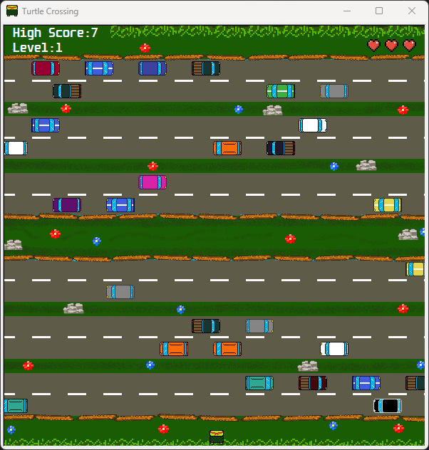
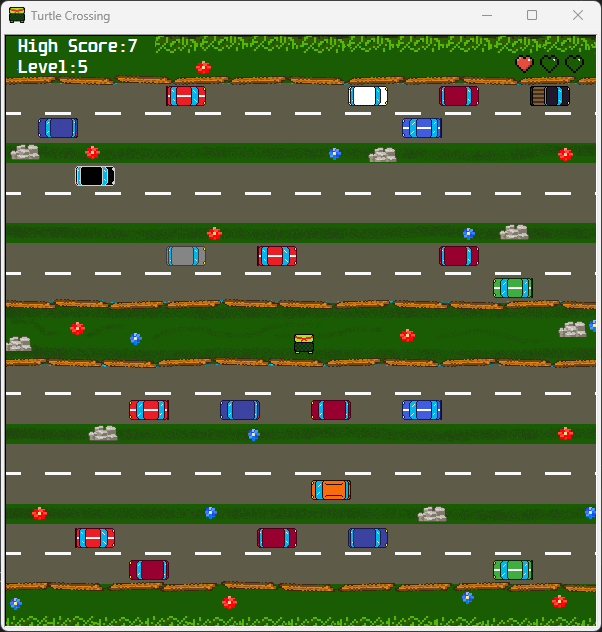
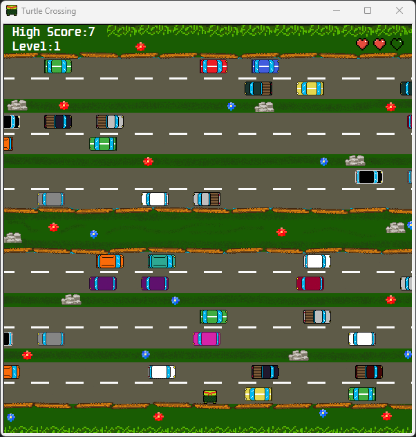
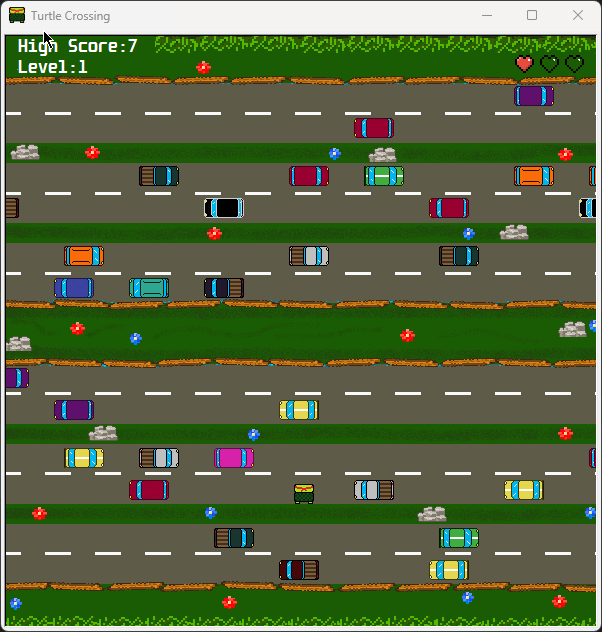

# 🏁 Turtle Crossing Game 🐢

## Overview 📄

Turtle Crossing is a simple game built using Python's Turtle graphics module. The objective is to cross a busy road, avoiding traffic, and progressing through levels. The game features increasing difficulty as you complete levels, with faster-moving vehicles.

## Gameplay 🎮

- Use the **Up** and **Down** arrow keys to navigate your turtle through the traffic.
- Press the **Escape** key to exit the game.
- You start with 3 lives.
- Colliding with a vehicle results in losing a life.
- When all lives are lost, the game is over.
- Each successful crossing completes a level, and the speed of vehicles increases.

## Running the Game ▶️

To play the game, run the main file:

```bash
python main.py
```

## Dependencies ⚙️
The game is built using Python's Turtle graphics module. No additional dependencies are required.

## Author 👨‍💻

- [@tsr1012](https://github.com/tsr1012)

## Preview 📸
* Level 1 <br>



* Increased difficulty on higher level <br>



* Losing a point (heart) <br>



* Game Over <br>

